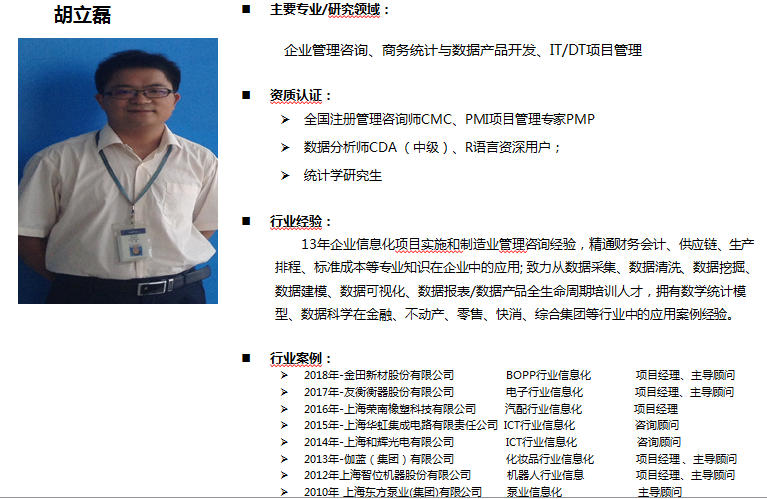
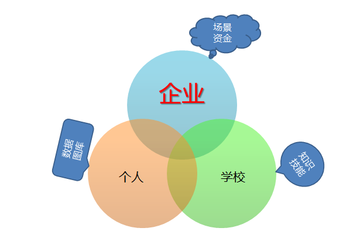
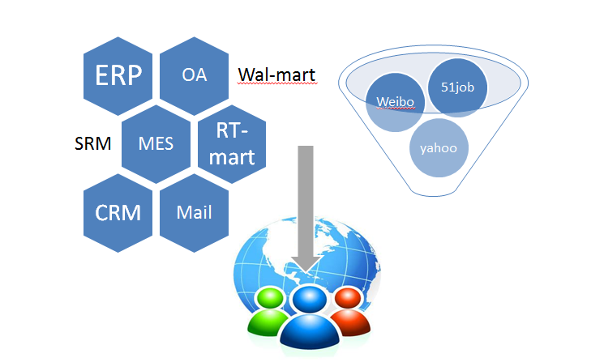
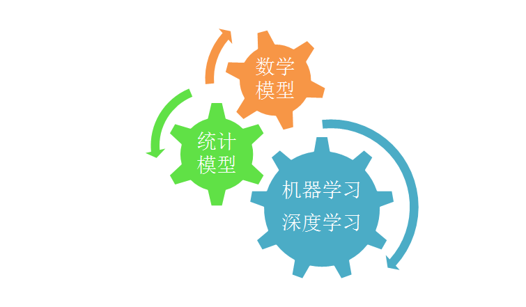
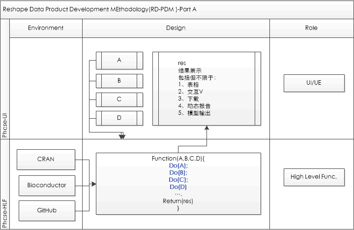
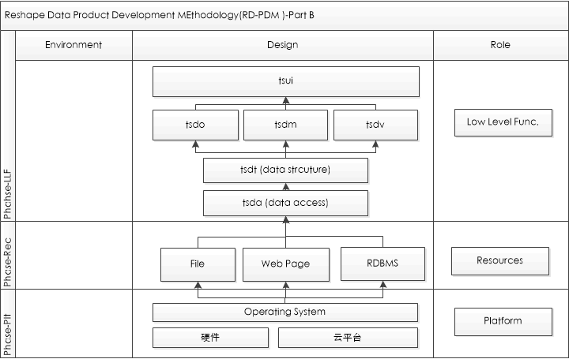
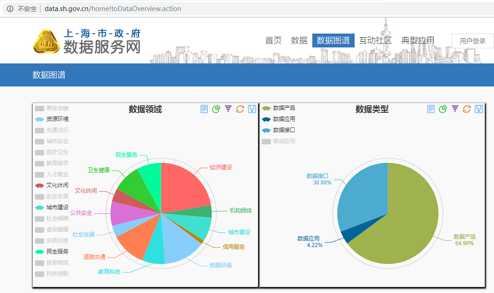
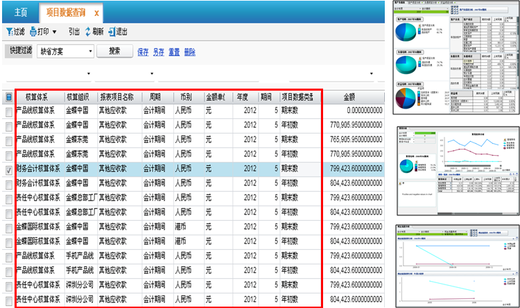
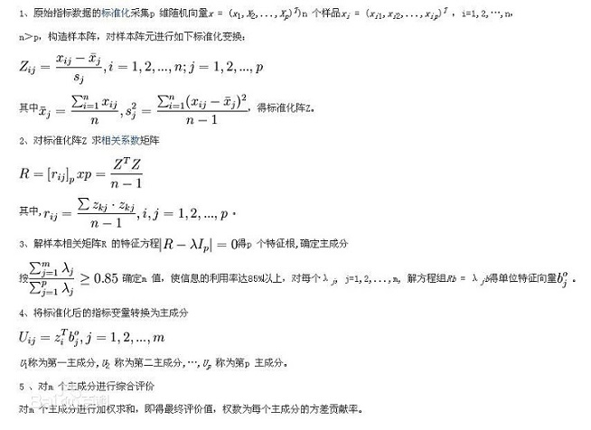

---
output:
  xaringan::moon_reader:
    css: ["zh-CN.css", "extra.css"]
    lib_dir: libs
    chakra: libs/remark-latest.min.js
    nature:
      highlightStyle: github
      highlightLines: true
      countIncrementalSlides: false
      ratio: '16:9'
---
background-image: url(./images/tk_Heading_169.png)
background-position: 50% 50%
class: top, left,
company: ©2019 ReshapeData
author: 胡立磊

## 企业级数据问题定义、建模、产品开发及行业应用

--

<br/>
<br/>
<br/>


### .red[&nbsp;&nbsp;&nbsp;&nbsp;构建数据思维,重塑数据价值]
<br/>
#### &nbsp;&nbsp;&nbsp;&nbsp;&nbsp;&nbsp;&nbsp;{{author}}<br/>&nbsp;&nbsp;&nbsp;&nbsp;&nbsp;&nbsp; `r Sys.Date()`


--
<br/>
<br/>
<br/>
<br/>


#### {{company}}
---
class: center,middle
### 简历


---
name: KDW
layout: false
background-image: url(./images/tk_Title_169.png)
background-position: 50% 50%
class: left, top, 


---
layout: true


--

### .matureBlue[市场定位]

--

### .golden[问题定义]

--

### .lightRed[模型构建]

--

### .green[产品开发]

--

### .darkBlue[开发过程]

--

### .skyBlue[行业应用]

--

### .darkcyan[案例分享]

---
name: KDB
layout: true
background-image: url(./images/tk_Body_169.png)
background-position: 50% 50%
class: left, top,
---
### .darkBlue[市场定位]


.center[]

---
### .darkBlue[问题定义]

.center[]

---
### .darkBlue[模型构建]

.center[]
---
### .darkBlue[产品开发]

 
.center[]
 

---
### .darkBlue[开发过程]

.center[]

---
### .darkBlue[行业应用]
.pull-left[
1. MES；

1. 上市公司财报；

1. 零售；

1. 运营；

1. 天气数据；

1. 招聘；

1. 电商;

1. 外卖;
]

.pull-right[
1. 会员；

1. 收银；

1. 传感器；

1. PDA；

1. 商业系统;

1. 邮件系统；

1. ERP;

1. PMS

]
---


---
### .darkBlue[案例分享]
---

#### .darkBlue[数学模型——张量运算]

m阶n维张量的定义


$$\mathcal{A}=(a_{i_1,\dots,i_m}), \quad a_{i_1,\dots,i_m}\in R, \quad 1\le i_1,\dots,i_m \le n.$$

更一般的定义(每一阶的维度不要求相同)
<br/>

$$vec(\mathcal{X})=\left(\begin{gathered}x_{111}\\x_{112}\\\vdots\\x_{121}\\    x_{122} \\\vdots\\x_{N_1N_2N_3}\end{gathered}\right)\in R^{n_1n_2n_3},\mathcal{X}\in R^{n_1\times n_2\times n_3}$$
---
#### 张量的应用--财务分析
.center[]

---
#### .darkBlue[统计模型——主成分分析PCA]
主成分分析（Principal Component Analysis，PCA）， 是一种统计方法。通过正交变换将一组可能存在相关性的变量转换为一组线性不相关的变量，转换后的这组变量叫主成分。


---
#### 步骤1：获取数据数据
```{r echo=FALSE, tidy=FALSE}
library(dpdc);

data('pca_data1');
DT::datatable(
  pca_data1,
  fillContainer = FALSE, options = list(pageLength = 10)
)
```

数据来源:费宇主编.多元统计分析——基于R.北京:中国人民大学出版社,2014，P88
---
#### 步骤2：计算相关系数
```{r}
pca_data2 <-pca_data1[,-1];
rownames(pca_data2) <- pca_data1[,1];
#pca_data2;
pca_cor <-round(cor(pca_data2),3);
pca_cor;
```
---
####步骤3：主成分建模型
```{r}
pca_model <- princomp(pca_data2,cor = T);
summary(pca_model,loadings = T);
```

---
####步骤4： 特征值与确认主成分个数
```{r}
pca_summary <- summary(pca_model,loadings = T);
#特征值
pca_summary$sdev^2;
#单个占比
pca_summary$sd^2/sum(pca_summary$sd^2);
#累计占比
cumsum(pca_summary$sd^2/sum(pca_summary$sd^2));
```
---
#### 步骤5：计算主成分得分
```{r}
#计算主成分得分
pca_score <-round(pca_model$scores,3);
pca_score <-addmargins(pca_score);
pca_score <- as.data.frame(pca_score);
#行业按得分进行排名，值越小实力越强
pca_score_sorted <- pca_score[order(pca_score$Sum),]
pca_score_sorted
```

---
#### .darkBlue[统计模型——广义线性模型GLM]
```{r echo=TRUE, fig.height=4, fig.width=14, message=FALSE, warning=FALSE, paged.print=FALSE}
library(dpdc)
data('glm_logistics_data1',package = 'dpdc')
log_model <- glm(FHaveCar~Fincome,family = binomial,data=glm_logistics_data1)
Fincome <-min(glm_logistics_data1$Fincome):max(glm_logistics_data1$Fincome);
probability<-log_fits(log_model,Fincome);
par(mfrow=c(1:2)); plot(glm_logistics_data1,main='原始数据');
start_point <-as.numeric(names(probability)[probability >0][1]);
end_point <- as.numeric(names(probability)[probability ==1][1]);
abline(v =start_point,col='red');abline(v = end_point,col='blue');
plot(Fincome,probability,main='模型数据');
abline(v =start_point,col='red');abline(v = end_point,col='blue');abline(h=0.8,col='green')

```


---
layout: false
name: KDTHX
background-image: url(./images/tk_Thankyou_169.png)
background-position: 20% 50%


